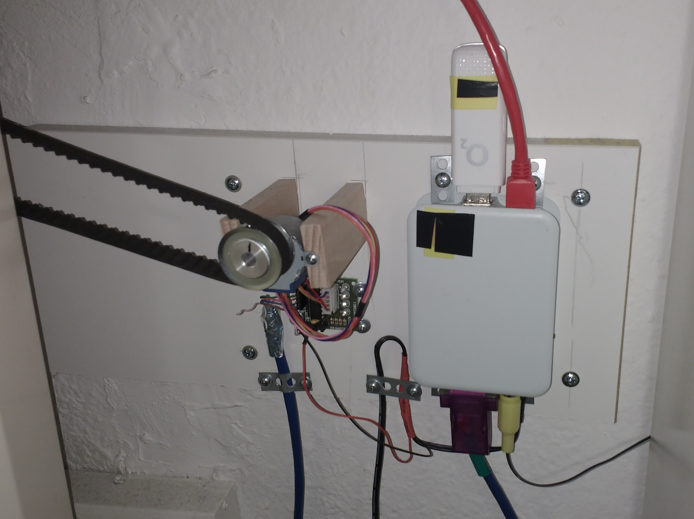
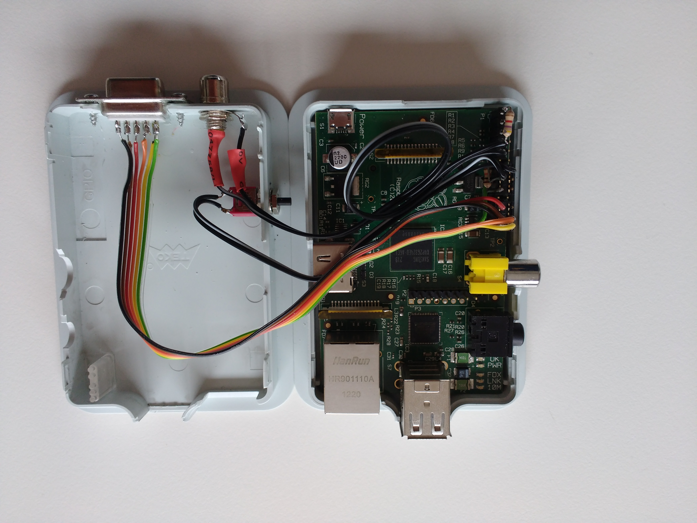

# SMS-Heizungs-Fernsteuerung

Ich arbeite regelmäßig mehrere Tage pro Woche an einem Ort, an dem ich 
nicht mit der Familie wohne und habe daher dort ein kleines Appartement 
gemietet. Dieses Appartement hat einen Nachteil: Es hat eine 
Nachtspeicherheizung. Die Heizung muss also am Abend bevor ich anreise, 
angedreht werde. Ein Festnetz-Internet-Anschluß lohnt sich für mich am 
Arbeitsort nicht. Telefonieren kann ich mobil sowieso soviel ich möchte 
und auch fürs Internet genügt mir mein Mobilfunkvertrag. 

Der Drehknopf für die Regelung der Nachtspeicherheizung ist schlecht 
zugänglich und ganz schlecht ablesbar angebracht und es ist mir mehr als 
einmal passiert, dass ich versehentlich die Heizung angestellt statt 
abgestellt habe. Einmal passierte mir das vor zwei Wochen Weihnachtsferien. 
Als ich wiederkam, war's zwar schön warm (ca. 27°C) und 'ne ganze Menge Geld 
war im wahrsten Sinne des Wortes verheizt. Also musste eine Lösung her. 
Ein Wohnungswechsel kam nicht in Frage, da der nur mit einer deutlich 
höheren Miete möglich wäre. So kam ich schließlich auf die Idee, die Heizung 
per SMS zu steuern. 

Einen Raspberry Pi und einen UMTS-Stick hatte ich 
sowieso in meinem Bastelvorrat. Also ein bisschen recherchiert und dann 
gebaut. Einen Provider (zufällig der, von dem auch der Stick ist) habe 
ich auch gefunden, der eine Prepaid-Karte, die man per 
Banküberweisung/Dauerauftrag (auch mit Kleinbeträgen) aufladen kann, 
im Programm hat. So buche ich alle paar Monate einen Euro auf die Karte, 
damit das System funktoniert.

Die Funktion ist in einem [anderen Dokument](file://Funktion.md) beschrieben.

## Aufbau

Der Raspi (Modell 1B) steuert eine kleinen Schrittmotor (28BYJ-48) an. 
An diesen ist ein Zahnrad geschraubt. Über den Drehknopf an der Heizung 
habe ich ein Stück Fahrradschlauch gezogen, um die Reibung zu erhöhen und 
ein Zahnriemen überträgt die Drehung des Motors auf den Drehknopf.

Den Raspi habe ich in ein passendes Gehäuse montiert, in das ich noch 
einen Sub-D-Stecker für den Anschluß des Schrittmotors und eine 
Cinch-Buchse für den Anschluß des Temperatursensors 
(und einen Taster für Reset/Shutdown) integriert habe.

## Hardware
UMTS-Stick: ZTE MF110 (siehe Ausgabe von *lsusb*)  
Temperatursensor: DS 1820 mit zweipoligem Kabel angeschlossen  
Motor: 28BYJ-48 5V-Version inkl. Treiberplatine  

## Software

Basis ist Raspbian. Da es schon eine ganze Weile her ist, seit ich das System 
installiert habe und mangels Internetanbindung auch keine Updates brauche, 
läuft immer noch Debian 8 (Jessie) und auch alle verwendeten Programme 
sind entsprechend alte Versionen.

Alles notwendige ist in Python programmiert und die Werte, 
(Anzahl der SMS; Stellung der Heizung;...) werden in einzelnen Dateien 
abgespeichert. Nicht elegant. Funktioniert aber.

### UMTS-Stick

Der UMTS-Stick meldet sich nicht auf Anhieb als Modem an, sondern als Speicherstick:

lsusb

> [    4.103764] usb 1-1.3: Product: ZTE WCDMA Technologies MSM  
> [    4.111182] usb 1-1.3: Manufacturer: ZTE,Incorporated  
> [    4.118052] usb 1-1.3: SerialNumber: P671A1DO2D010000  
> [    4.131425] usb-storage 1-1.3:1.0: USB Mass Storage device   detected  
> ...  
> [   25.836912] usb 1-1.3: USB disconnect, device number 4  
> [   30.940519] usb 1-1.3: new high-speed USB device number 5 using dwc_ otg  
> [   31.044298] usb 1-1.3: New USB device found, idVendor=19d2, idProduct=0031  
> [   31.044337] usb 1-1.3: New USB device strings: Mfr=3, Product=2, SerialNumber=4  
> [   31.044357] usb 1-1.3: Product: ZTE WCDMA Technologies MSM  
> [   31.044375] usb 1-1.3: Manufacturer: ZTE,Incorporated  
> [   31.044393] usb 1-1.3: SerialNumber: P671A1DO2D010000  
> [   31.064298] usb-storage 1-1.3:1.2: USB Mass Storage device detected  
> [   31.066590] scsi host1: usb-storage 1-1.3:1.2  
> [   31.163362] usbcore: registered new interface driver usbserial  
> [   31.166293] usbcore: registered new interface driver usbserial_ generic  
> [   31.169021] usbserial: USB Serial support registered for generic  
> [   31.211180] usbcore: registered new interface driver option  
> [   31.214297] usbserial: USB Serial support registered for GSM modem (1-port)  
> [   31.217886] option 1-1.3:1.0: GSM modem (1-port) converter detected  
> [   31.219647] usb 1-1.3: GSM modem (1-port) converter now attached to ttyUSB0  
> [   31.220407] option 1-1.3:1.1: GSM modem (1-port) converter detected  
> [   31.232348] usb 1-1.3: GSM modem (1-port) converter now attached to ttyUSB1  
> [   31.233122] option 1-1.3:1.3: GSM modem (1-port) converter detected  
> [   31.246633] usb 1-1.3: GSM modem (1-port) converter now attached to ttyUSB2  
> [   32.062755] scsi 1:0:0:0: Direct-Access     ZTE      MMC Storage      2.31 PQ: 0 ANSI: 2  

Deshalb muss in **/etc/rc.local** der Stick noch in den richtigen Modus gebracht werden:

> /etc/init.d/gammu-smsd stop  
> /usr/sbin/usb_modeswitch -c /etc/usb_modeswitch.conf  
> /etc/init.d/gammu-smsd start

Am Ende gibt *lsusb* dann alles korrekt aus:  
> Bus 001 Device 005: ID 19d2:0031 ZTE WCDMA Technologies MSM MF110/MF627/MF636  
> Bus 001 Device 003: ID 0424:ec00 Standard Microsystems Corp. SMSC9512/9514 Fast Ethernet Adapter  
> Bus 001 Device 002: ID 0424:9512 Standard Microsystems Corp. LAN9500 Ethernet 10/100 Adapter / SMSC9512/9514 Hub  
> Bus 001 Device 001: ID 1d6b:0002 Linux Foundation 2.0 root hub  

### Temperatursensor

Dieser muss in **/boot/config.txt** richtig konfiguriert werden:

>  # Activating 1-wire with pullup  
> dtoverlay=w1-gpio-pullup,gpiopin=4,pullup=1

## Fazit

Das Ganze funktioniert seit weit über einem Jahr ohne Probleme: Geheizt 
wird nur wenn ich es will. Und solange ich nicht vergesse, rechtzeitig 
eine SMS abzuschicken, ist es auch immer warm, wenn ich ins Appartement komme. 
